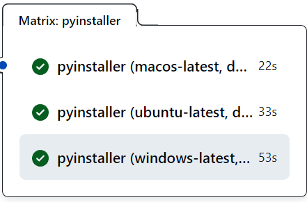

### Experiencia con Python
La verdad es que no tengo una experiencia muy grande buildeando imagenes en Python. Cuando he tenido que hacerlo, he usado la libreria pyinstaller, la cual esta bastante bien para buildear ejecutables pero siempre sobre el sistema operativo en el que estes.
No he encontrado en la documentación de Pyinstaller nada que nos permita buildear un ejecutable de linux en un SO windows, o viceversa (o para macos). Normalmente lo que se hace es usar distintas maquinas virtuales cuando procesas el workflow de CI/CD para buildearlas

### Usando Go
Go en cambio te permite desde cualquier SO, buildear un ejecutable para distintos sistemas operativos. Para ello hay que indicarlo con el parámetro GOOS:

-   Windows: `env GOOS=windows go build .` 
-   Linux: `env GOOS=linux go build .`
-   MacOS: `env GOOS=darwin go build .`

GOARCH en cambio es para definir el tipo de arquitectura de la plataforma:

-   `env GOOS=windows GOARCH=amd64 go build .`

De esta manera, desde cualquier SO, podemos buildear distintos ejecutables. Algo que nos facilita la vida a la hora de generar los ejecutables